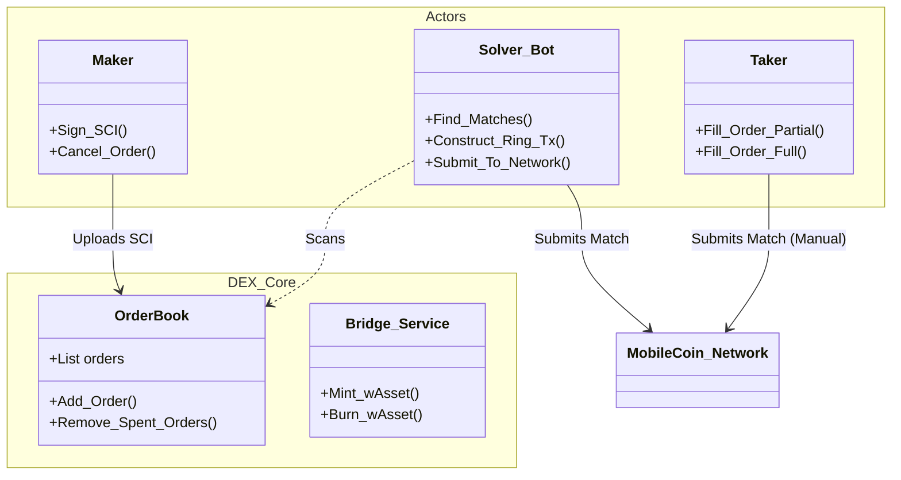
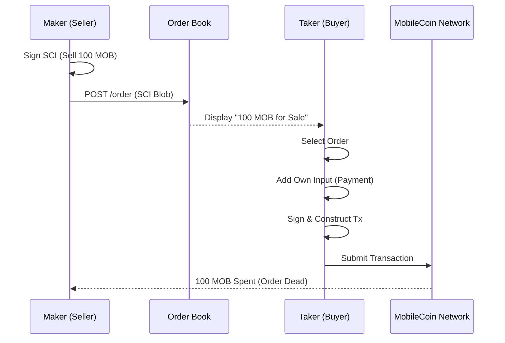
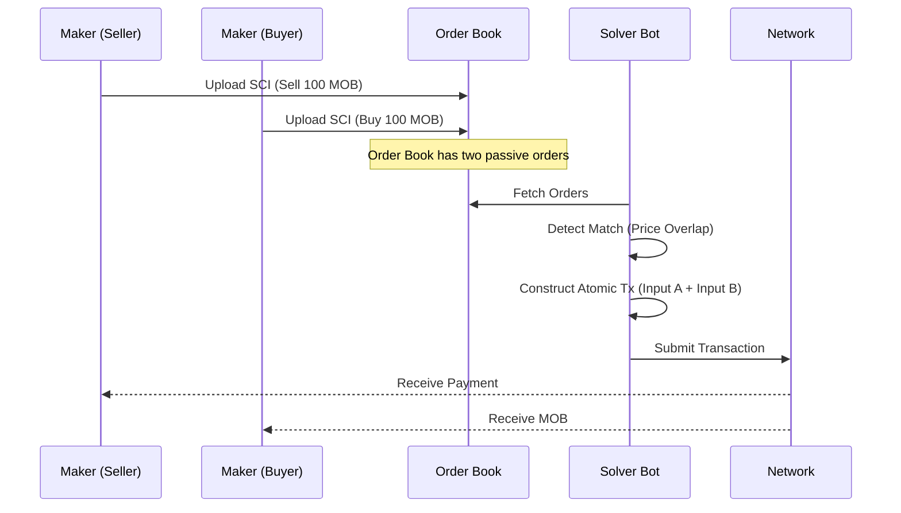
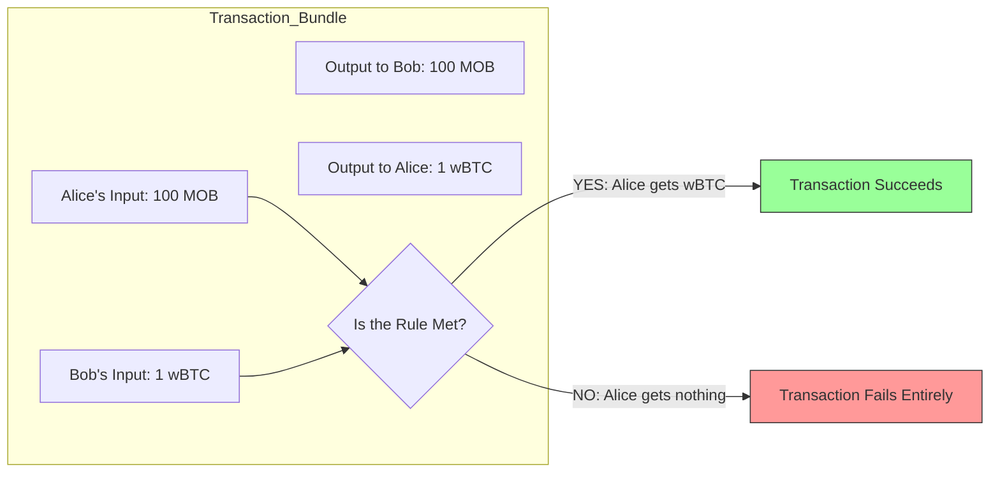
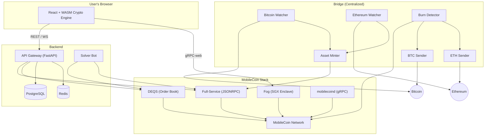
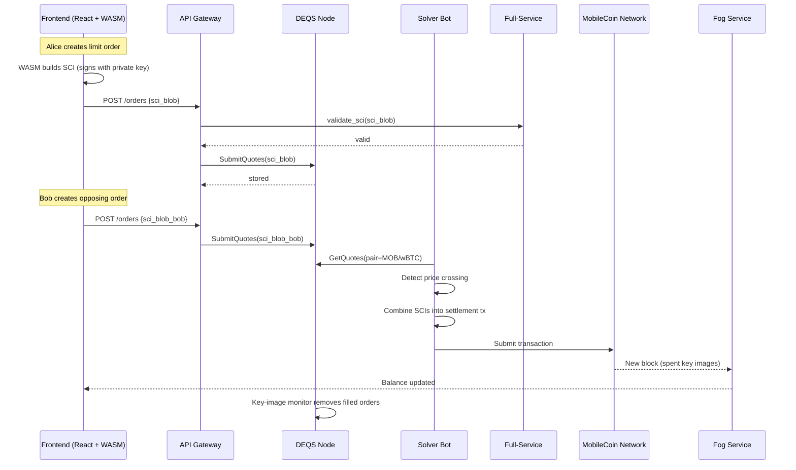
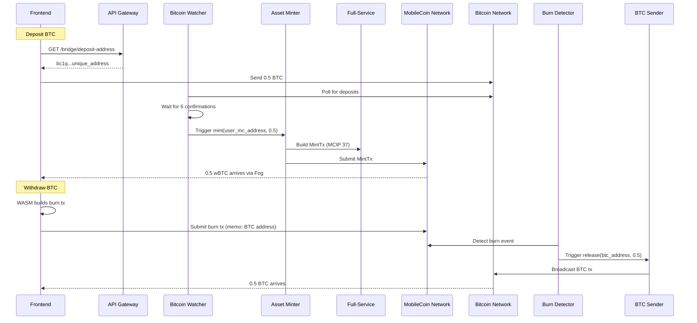
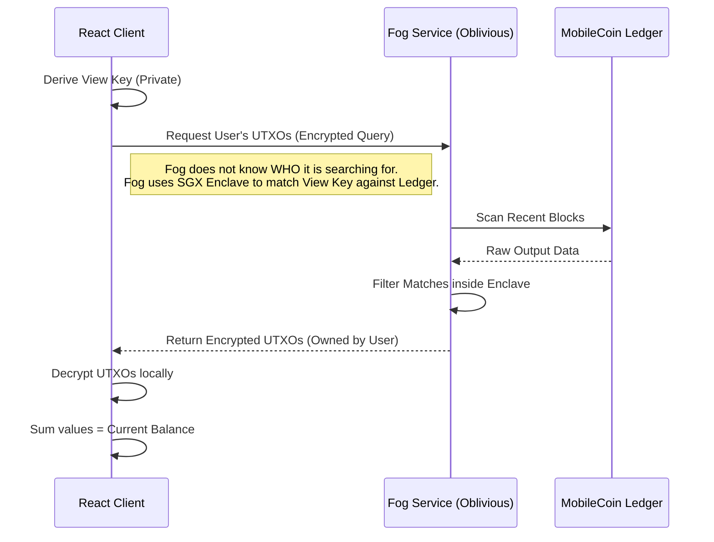
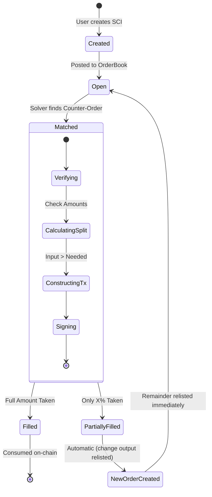

# Architectural Diagrams

All system diagrams in one place. Each section is anchored — other documents link here rather than embedding diagrams inline.

---

## System Class Hierarchy

The proposal moves away from the "Dealer" model (where the App is the counterparty) toward a "Marketplace" model (where the App is just a board). This class diagram shows the key domain entities and their relationships.

---

## Manual Matching

The traditional "Bulletin Board" approach. The taker selects an order, constructs the transaction locally, and submits it. Harder for users but simpler infrastructure.

---

## Automated Solver Matching

The solver bot monitors the order book for price-crossing orders, combines their SCIs into a single atomic transaction, and submits it. Seamless for users.

---

## SCI Mechanics

Explaining [Signed Contingent Inputs](./09_glossary.md#signed-contingent-input-sci) to non-cryptographers. The contingency rule means Alice's input can only be spent if the transaction also includes the required counter-payment — otherwise the network rejects it entirely.

---

## Example System Configuration

One possible combination of decisions: Web/WASM frontend, Antelope fork, DEQS order book, Full-Service + mobilecoind wallet, centralized bridge. Other combinations would look different — this is just a reference point. See [Proposed System Components](./04_system_components.md) for how each decision shapes the stack.

---

## Trade Flow

From SCI creation to settlement, mapped to services.

*Assumes: Web/WASM frontend, Order Book + Solver, DEQS, Full-Service wallet backend.*

---

## Bridge Flow

Deposit and withdrawal sequence for a centralized bridge. Only applies if a bridge is chosen ([Decision 3](./07_asset_integration.md)).

*Assumes: Centralized bridge with Bitcoin.*

---

## Fog Balance Scanning

How the frontend discovers incoming payments without revealing user identity. See [System Design Section 1](./01_system_design.md#1-fog-private-transaction-discovery).

---

## Order Lifecycle

An order progresses from creation through matching to settlement. [Partial fills](./09_glossary.md#partial-fill) consume the original SCI and produce a change output that can be relisted. See [Architecture Decisions Section 3](./02_architecture_decisions.md#3-partial-fill-mechanics).

*Assumes: Order Book + Solver model ([Decision 2](./06_matching_engine.md)).*

